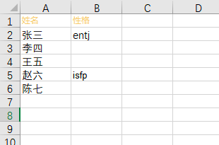

# 点兵点将 - 课堂互动工具

基于 Electron-Vite + React + TypeScript 构建的课堂问答与随机选人系统

## 📦 功能特性

### 核心功能

- **双模式切换**
  - 📚 课堂问答系统：支持题目展示/答案揭示
  - 🎮 随机选人系统：支持多人随机选取
- **智能主题**
  - 🌓 亮色/暗色主题一键切换

### 新增数据库功能

- **数据管理**
  - 📤 Excel数据导入（支持.xlsx/.xls格式）
    列明要保持一直

    - ❓ 题目数据（questions表）

  

  - 👥 学生数据（students表）

  

## 🚀 快速开始

### 安装依赖

### Install

```bash
yarn
```

### Development

```bash
yarn dev
```

### Build

```bash
# For windows
$ yarn build:win

# For macOS
$ yarn build:mac

# For Linux
$ yarn build:linux
```
